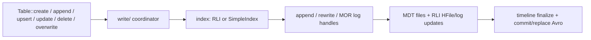

<!--
  ~ Licensed to the Apache Software Foundation (ASF) under one
  ~ or more contributor license agreements.  See the NOTICE file
  ~ distributed with this work for additional information
  ~ regarding copyright ownership.  The ASF licenses this file
  ~ to you under the Apache License, Version 2.0 (the
  ~ "License"); you may not use this file except in compliance
  ~ with the License.  You may obtain a copy of the License at
  ~
  ~   http://www.apache.org/licenses/LICENSE-2.0
  ~
  ~ Unless required by applicable law or agreed to in writing,
  ~ software distributed under the License is distributed on an
  ~ "AS IS" BASIS, WITHOUT WARRANTIES OR CONDITIONS OF ANY
  ~ KIND, either express or implied.  See the License for the
  ~ specific language governing permissions and limitations
  ~ under the License.
-->

# hudi-rs Writer Design (review brief)

**Audience:** third-party review (human or agent). Read this end-to-end before reviewing
code on branch `feat/table-writes`. Treat Spark/`~/Code/hudi` as the on-disk semantic
oracle; do **not** expect a Spark class-hierarchy port.

| Field | Value |
|-------|--------|
| Branch | `feat/table-writes` (off `main`) |
| Scope | Native Rust writes in `hudi-core` only |
| Companion | [reader-spec.md](./reader-spec.md) (read APIs) |
| Status date | 2026-07-29 |
| Overall | **Feature-complete for single-node `Table` write verbs on COW+MOR (Parquet); Spark storage interop not yet green** |

---

## 1. One-paragraph summary

hudi-rs is growing a **single-node, Arrow-first write path** on `Table`: `create`,
`append`, `upsert` / `upsert_with`, `update`, `delete` / `delete_keys`, `overwrite`.
Writes target **COPY_ON_WRITE** and **MERGE_ON_READ** (Parquet base + Parquet log
blocks), with **MDT `files` + optional RLI**, SimpleIndex fallback, commit-time and
event-time ordering, auto keygen, and hive-style partitioned paths that **retain**
partition columns in data files. Custom payloads/mergers error out. DataFusion /
Python / C++ write bindings, Lance/Vortex, compaction/clean/cluster/archive, and full
multi-writer concurrency control are **out of scope** for this effort.

Rust unit/lifecycle tests pass for the verbs above. **Spark↔Rust byte-level /
read-after-write interop is still broken** on several known paths (listed in §7).
Those seven interop gaps are the next implementation slice (one commit each),
followed by a storage-parity harness (Rust write → Spark read and vice versa;
COW+MOR; snapshot / read-optimized / incremental; mixed ops).

---

## 2. Goals and non-goals

### Goals (this project)

1. Arrow `RecordBatch` verbs on `Table` (`create`, `append`, `upsert`, …).
2. On-disk layout that Spark **should** be able to read (table props, Avro commit
   metadata, MDT/RLI HFiles, timeline naming) — validated against Java Hudi 1.0.
3. COW: append → upsert / partial upsert / delete / overwrite / expression update.
4. MOR: append → upsert / delete / expression update with **Parquet log blocks only**.
5. Indexes: **RLI default** (requires MDT); **SimpleIndex** when RLI off.
6. Ordering: **COMMIT_TIME_ORDERING** and **EVENT_TIME_ORDERING** only.
7. MDT always on by default (`with_metadata(true)`); partitions written today:
   **`files`** + **`record_index`** (when RLI on).
8. Single-process multithreaded IO is fine; **no** Spark WorkloadProfile /
   UpsertPartitioner / RDD shuffle port.

### Non-goals (explicit)

| Deferred | Notes |
|----------|--------|
| DataFusion `INSERT` / DF writes | Thin wrappers later |
| Python / C++ write bindings | Mirror core later |
| Custom payload / custom merger | Hard error |
| Avro / HFile **data** log blocks | Parquet logs only |
| MDT `column_stats` / `partition_stats` writers | Stubs return “not implemented” |
| Compaction / clean / cluster / archive | Next project after concurrency |
| Lance / Vortex formats | After Parquet path + concurrency |
| Multi-writer optimistic concurrency | Scaffold only (reload timeline; no lock/conflict check) |
| Bit-identical Spark layouts | FileId UUID / 10 RLI shards / sizes — tracked as open gaps |

---

## 3. Design principles (review these for consistency)

1. **Spark = oracle, not template.** Validate props, commit Avro, MDT records, and
   query results against Spark-written tables. Do not mirror `*ActionExecutor` trees.
2. **Arrow is the write contract.** No public `HoodieRecord` / `list[dict]` API.
3. **Table owns writes.** Path-based `Table::create` / `Table::new`; no catalog.
4. **Only Java `HoodieTableConfig` keys** in `hoodie.properties`. Do not invent
   Rust-only table props. Prefer typed enums; bulk option maps may still use strings.
5. **Vendored Java Avro schemas** under `crates/core/schemas/` — do not hand-roll
   alternate namespaces for commit/MDT payloads.
6. **Hive-style partitions keep column values in data files** (no strip-on-write).
7. **Comments explain WHY** (interop constraints), not the roadmap.

---

## 4. Architecture



| Area | Path | Role |
|------|------|------|
| Public API | `crates/core/src/table/mod.rs` | Verbs on `Table` |
| Create | `crates/core/src/write/create.rs` | `hoodie.properties`, MDT bootstrap |
| Append | `crates/core/src/write/append.rs` | Inserts, size split, meta fields, keygen |
| Mutating writes | `crates/core/src/write/rewrite.rs` | Upsert / update / delete / overwrite |
| Keygen | `crates/core/src/write/keygen.rs` | Auto key when no record-key fields |
| MDT writer | `crates/core/src/write/metadata.rs` | Bootstrap + `files` / RLI updates + MDT deltacommit fencing |
| Indexes | `crates/core/src/index/{simple,record}.rs` | Tag locations |
| Commit Avro | `crates/core/src/metadata/{commit,replace_commit}.rs` + `schema/avsc.rs` | Encode with vendored `.avsc` |
| Schemas | `crates/core/schemas/*.avsc` | Java-copied commit / replace / MDT / delete list |
| Merge reads | Existing `FileGroupReader` | COW rewrite / MOR snapshot |

### Instant / timeline conventions (intended)

- Data commits: timestamp `yyyyMMddHHmmssSSS` (table version 8 layout).
- MDT: MOR-style **`.deltacommit`** with `.requested` → `.inflight` → completed
  `{requested}_{completion}.deltacommit`.
- Data timeline fencing (`.commit.requested` / `.inflight`) — **not yet written**
  (see §7.3).

### Defaults on `Table::create`

| Knob | Default |
|------|---------|
| Table type | COW |
| Table version / timeline layout | 8 / 2 (when MDT on); 6 / 1 if MDT off |
| MDT | **on** |
| RLI | **on** (requires MDT) |
| Meta fields | **on** |
| Hive-style partitioning | **on** (when partition fields set) |
| Record key | optional → auto keygen |
| Ordering / precombine | optional |
| Parquet compression | **zstd** |
| Max base file size (append split) | `hoodie.parquet.max.file.size` ≈ 120 MiB |

---

## 5. Public API (as implemented)

```rust
let mut table = Table::create(uri)
    .with_table_name("trips")
    .with_table_type(TableTypeValue::CopyOnWrite) // or MergeOnRead
    .with_record_key_fields(["id"])               // omit → auto keygen
    .with_partition_fields(["city"])              // optional
    .with_ordering_fields(["ts"])                 // optional; enables event-time path
    .with_metadata(true)                          // default true
    .with_record_index(true)                      // default true
    .create()
    .await?;

table.append(batches).await?;
table.append_only(batches).await?;               // strict append_only tables only
table.upsert(batches).await?;
table.upsert_with(batches, UpsertOptions { update_columns: Some(vec!["y"]), .. }).await?;
table.update("city = 'sf'", set_batch /* exactly 1 row */).await?;
table.delete("id = 'a'").await?;                  // key =/IN → RLI; else scan
table.delete_keys(keys).await?;
table.overwrite(batches).await?;                  // full table, COW only
table.dynamic_partition_overwrite(batches).await?; // partitioned COW only
```

### Verb comparison (common lakehouse shapes)

| Common shape | hudi-rs | Notes |
|--------------|---------|-------|
| insert / append | `append(batches)` | Insert-oriented fast path. |
| full overwrite | `overwrite(batches)` | Full-table replacecommit (`INSERT_OVERWRITE_TABLE`) on COW. |
| partition overwrite | `dynamic_partition_overwrite(batches)` | Replaces only partitions present in input (`INSERT_OVERWRITE`). |
| strict append-only | `append_only(batches)` | Requires `hoodie.record.merge.mode=append_only`. |
| overwrite with filter | not yet implemented | Can be layered later on delete+append semantics. |
| upsert / update / delete | `upsert` / `upsert_with` / `update` / `delete` / `delete_keys` | Hudi-native mutating verbs. |

### Verb semantics

| Verb | Behavior |
|------|----------|
| `append` | Insert-only commit; partitioned hive paths; size-split bases; MDT `files` (+ RLI for new keys when enabled) |
| `append_only` | Same insert path as `append`, but errors unless the table merge mode is `append_only` |
| `upsert` | Full-row upsert by record key; RLI or SimpleIndex tag; COW rewrite or MOR parquet log |
| `upsert_with` | Partial column update on match (`update_columns`); **COW only** — MOR returns Unsupported |
| `update` | Expression SET: single-row batch, any-column filter; scan + rewrite/log |
| `delete` | Filter string; `=` / `IN` on record key or `_hoodie_record_key` → `delete_keys`; else snapshot scan |
| `delete_keys` | Explicit keyed path (RLI / SimpleIndex) |
| `overwrite` | Replace-commit full table replace (`INSERT_OVERWRITE_TABLE`); **COW**; MOR unsupported |
| `dynamic_partition_overwrite` | Replace only partitions present in input (`INSERT_OVERWRITE`); partitioned **COW** only |

### Capability matrix

| Op | COW unpart. | COW part. | MOR unpart. | MOR part. |
|----|:-----------:|:---------:|:-----------:|:---------:|
| append | yes | yes | yes | yes |
| append_only | yes | yes | yes | yes |
| upsert (full) | yes | yes* | yes | yes* |
| partial upsert | yes | yes* | **no** | **no** |
| update (expr) | yes | yes* | yes | yes* |
| delete (expr / keys) | yes | yes* | yes | yes* |
| overwrite | yes | yes | **no** | **no** |
| dynamic partition overwrite | **no** | yes | **no** | **no** |

\*Partitioned mutating paths exist; review should verify no partition-path collapse /
wrong relative paths under all mixes (open hardening item §7.6).

### Ordering

- No ordering fields → commit-time / last-write wins within the merge handle.
- `with_ordering_fields` → `EVENT_TIME_ORDERING` props + merge compares ordering columns.
- Custom `hoodie.compaction.payload.class` / custom merger → **error**.

---

## 6. What is done (evidence)

Branch commits (newest first, `main..HEAD`):

| Commit | What landed |
|--------|-------------|
| `5168885` | Tests: expression update/delete + partitioned lifecycles |
| `598629f` | Expression `update` + flexible `delete` with RLI auto-route |
| `c9ab92f` | Spark-aligned create defaults + partitioned appends |
| `5561e8c` | RLI tagging + MDT RLI updates |
| `40603eb` | Auto keygen, optional precombine, zstd Parquet |
| `36dd5ca` | MDT/RLI encode via `HoodieMetadata.avsc` |
| `c4b406a` | Vendor Java commit / replace Avro schemas |
| `dc152ac` | Drop MDT instance cache; reload timeline before writes |
| `383ccf9` | Reload MDT after writes; lifecycle tests |
| `794fc5f` | SimpleIndex hardening + edge-case tests |
| `e968fc3` | MOR writes (Parquet log blocks) |
| `03cdc66` | Event-time ordering on COW upserts |
| `fb5a334` | COW upsert / delete / overwrite |
| `445d09f` | MDT `files` partition writer |
| `f334e5b` | `Table::create` + `append` |

### Test coverage (Rust)

- `crates/core/tests/table_write_tests.rs` — unit paths (create/append, upsert/delete/overwrite, partial upsert, event-time, MOR logs, empty/schema/dedupe edges, non-key delete, key→RLI delete, expression update, MOR update/delete).
- `crates/core/tests/table_write_lifecycle_tests.rs` — COW/MOR lifecycles with MDT, RLI on/off, partitioned COW/MOR, props shape vs Spark, optional dump via `HUDI_RS_INTEROP_OUT`.

Run:

```bash
./build-wrapper.sh cargo test -p hudi-core --test table_write_tests --test table_write_lifecycle_tests
```

### Interop experiments already run (manual)

- Spark 3.5 + Hudi 1.0 bundle wrote reference tables under `/tmp/hudi-interop/`.
- Rust writes comparable partitioned trips tables.
- **Findings:** props overlap improved (checksum, `PARQUET`, instant format, MDT deltacommit fencing); Spark still fails or returns **0 rows** on Rust tables for MDT-on (HFile Utf8 cast) and MDT-off (listing/commit decode). Not bit-identical (file counts/sizes, RLI shard count, fileId style).

---

## 7. What is left — open interop defects (priority)

These seven items were identified from Spark side-by-side and are the **next fix
slice**. Intended process: **one commit per issue**, then a storage-parity suite.

### 7.1 MDT HFile key interop (P0)

- **Symptom:** Spark `ClassCastException: Utf8 cannot be cast to String` in
  `HoodieBackedTableMetadata.fetchBaseFileRecordsByKeys` when reading Rust MDT.
- **Likely area:** HFile key encoding in MDT/RLI writers (`write/metadata.rs`,
  HFile writer, Avro→bytes path).
- **Done when:** Spark can open an MDT-on Rust table and `count(*) > 0`.

### 7.2 Spark file listing / commit Avro (P0)

- **Symptom:** With MDT off, Spark sees schema but **count = 0** (path listing /
  commit writeStat decode mismatch).
- **Likely area:** `metadata/commit.rs`, vendored `HoodieCommitMetadata.avsc`
  encode path (`schema/avsc.rs`), path fields in write stats.
- **Done when:** Spark reads MDT-off Rust COW append table with correct row count.

### 7.3 Data timeline REQUESTED / INFLIGHT (P1)

- **Symptom:** Data commits write completed files only; no
  `.commit.requested` / `.inflight` (MDT already fences deltacommit).
- **Done when:** Data timeline matches Java fencing for commit / deltacommit /
  replacecommit as applicable.

### 7.4 RLI sharding + UUID fileIds (P2)

- **Symptom:** Rust uses 1 RLI shard and deterministic `append-*` (or similar)
  fileIds; Spark uses 10 shards + UUID fileIds.
- **Done when:** Defaults match Java (or documented deliberate single-node
  subset with a prop to opt into Java defaults).

### 7.5 Parquet WriterProperties parity (P2)

- **Symptom:** Compression now zstd; block/page/dictionary/etc. not fully aligned
  to Java `HoodieParquetConfig`.
- **Done when:** Writer props keyed off the same `hoodie.parquet.*` configs Java
  uses (sizes may still differ by row content).

### 7.6 True COW location rewrite hardening (P1)

- **Symptom:** Risk of full-partition collapse / wrong file-group targeting under
  some partitioned upsert/delete/update mixes.
- **Done when:** Lifecycle + parity tests cover multi-file partitions with mixed
  ops without collapsing unrelated file groups.

### 7.7 MDT / data crash consistency (P1)

- **Symptom:** Order is still roughly “write data → write MDT → finalize”; crash
  window can strand data without MDT or vice versa.
- **Done when:** Documented and implemented ordering closer to Java (or
  recoverable cleanup), with a regression test that simulates mid-commit failure.

### After §7 — storage parity harness (required validation)

Not a separate “product feature,” but the acceptance gate:

1. **Rust write → Spark read** and **Spark write → Rust read**.
2. Table types: **COW** and **MOR**.
3. Query types: **Snapshot**, **Read-Optimized**, **Incremental** (plus time-travel
   where applicable).
4. Op mix: append, upsert, update, delete, overwrite (where supported).
5. Assert row-level correctness (counts + key/column equality), not only “opens.”

Suggested location: `crates/core/tests/` integration + scripts under something like
`benchmark/` or `python/tests` using the existing Hudi Spark bundle
(`/Users/vc/Cache/1.0-testing/ga/hudi-spark3.5-bundle_2.12-1.0.0-SNAPSHOT.jar`
or Ivy-resolved 1.0.0).

---

## 8. Deferred projects (after interop is green)

### 8.1 Concurrency control

- No long-lived MDT/listing cache across ops (partially done: cache drop + reload).
- Before plan: reload active timeline; read MDT/data vs that snapshot.
- Before commit: lock → refresh → conflict check → finalize.
- Not done: lock + conflict detection.

### 8.2 Table services (data + MDT)

Compaction, clean, cluster, archive, rollback/restore beyond basic orphan cleanup.

### 8.3 MDT stats partitions

Implement `column_stats` / `partition_stats` writers (encode stubs already error).

### 8.4 Bindings and formats

DataFusion / Python / C++ write mirrors; Lance then Vortex.

---

## 9. Module map (review entry points)

```
crates/core/
  schemas/           # HoodieCommitMetadata, ReplaceCommit, HoodieMetadata, delete list
  src/
    table/mod.rs     # public verbs
    write/
      create.rs      # properties + bootstrap
      append.rs      # inserts + size split + parquet props
      rewrite.rs     # upsert/update/delete/overwrite
      keygen.rs
      metadata.rs    # MDT files + RLI + deltacommit fencing
    index/
      simple.rs
      record.rs      # RLI
    metadata/
      commit.rs
      replace_commit.rs
      table/         # MDT read + encode helpers (col/part stats stubs)
    schema/avsc.rs   # load .avsc + encode_with_schema
    file_group/      # existing reader used on merge path
  tests/
    table_write_tests.rs
    table_write_lifecycle_tests.rs
```

Java oracle (local clone assumed): `~/Code/hudi` — especially
`HoodieTableConfig`, `HoodieCommitMetadata.avsc`, `HoodieMetadata.avsc`,
`HoodieBackedTableMetadata`, Spark COW/MOR commit executors (semantics only).

---

## 10. Review checklist (for the third-party reviewer)

Use this as the review charter. Prefer **defect findings** over style nits.

### Correctness / interop

- [ ] Every `hoodie.*` key written on create exists on Java `HoodieTableConfig` (or
      documented write-stat-only configs). Flag invented keys.
- [ ] Commit / replace / MDT Avro resolve against vendored `.avsc` with Java field
      order and union nullability (esp. `version: ["int","null"]` style).
- [ ] HFile keys/values for MDT `files` and `record_index` match Java byte/string
      typing (root cause of Utf8 cast).
- [ ] WriteStat paths in commit metadata are Spark-listable (relative vs absolute,
      partition prefix, log vs base).
- [ ] Partitioned writes: hive path `col=val`, values still present in Parquet schema.
- [ ] RLI updates stay consistent with data commits for upsert/delete.
- [ ] Event-time: older ordering value must not win over newer.
- [ ] MOR: snapshot merges base+logs; RO ignores logs; incremental sees log commits.

### API / product

- [ ] Verb docs match behavior (especially `update` single-row SET, `delete` RLI route).
- [ ] Unsupported paths return clear `Unsupported` / `Write` errors (MOR overwrite,
      MOR partial upsert, custom payload).
- [ ] Empty inputs / zero-match delete/update: no spurious commits.

### Safety

- [ ] Failure after data write but before commit/MDT: orphans cleaned or documented.
- [ ] Timeline reload before write actually observed (no stale FG plan).
- [ ] Crash window §7.7 acknowledged; do not claim atomic multi-table commit yet.

### Tests

- [ ] New features/bugfixes have tests; interop gaps should gain regression tests once
      fixed (prefer a Spark-in-the-loop or fixture golden where feasible).
- [ ] Do not require bit-identical fileIds to claim semantic parity — but document
      intentional differences.

### Out of scope for this review

- Porting Spark executor class hierarchies.
- Implementing compaction/clean in the same PR as interop fixes.
- Python/C++/DataFusion write API design (unless core signature is being frozen
      incompatibly).

---

## 11. Success criteria (updated)

**Project-complete when:**

1. §5 verbs work on COW+MOR as in the capability matrix, with Rust tests green.
2. All seven §7 defects fixed (or explicitly waived with rationale in this doc).
3. Storage parity harness passes for Rust↔Spark, COW+MOR, three query types, mixed ops.
4. No invented table property keys; Avro/MDT schemas stay Java-vendored.
5. Deferred §8 items remain deferred (not silently half-implemented).

**Current claim:** (1) largely true for Rust-only; (2)–(3) **false**; (4) mostly true
after schema-vendor commits; (5) true (`column_stats`/`partition_stats` correctly
unimplemented).

---

## 12. How to reproduce Spark oracle locally

```bash
# Rust dump (example)
HUDI_RS_INTEROP_OUT=/tmp/hudi-parity/rust-cow \
  ./build-wrapper.sh cargo test -p hudi-core \
  --test table_write_lifecycle_tests \
  test_create_props_match_spark_shape -- --nocapture

# Spark bundle (example path used in development)
# /Users/vc/Cache/1.0-testing/ga/hudi-spark3.5-bundle_2.12-1.0.0-SNAPSHOT.jar
# Compare hoodie.properties, .hoodie timeline names, MDT layout, then:
#   spark.read.format("hudi").load(<rust_table>)  # expect count > 0 once §7.1–7.2 fixed
```

Reference dumps from earlier sessions may exist under `/tmp/hudi-interop/` (not in git).

---

## Document history

| Date | Change |
|------|--------|
| 2026-07-29 | Initial review brief: reflect `feat/table-writes` reality, §7 interop gap list, success criteria vs stale phase plan |

Supersedes the narrative status in the Cursor plan
`spark-parity_write_support_e3ffee71` for “what’s done / left”; that plan’s phase
A–F intent remains historical context, but several of its checkboxes overstated MDT
stats completeness and understated RLI / expression-update work that landed later.
